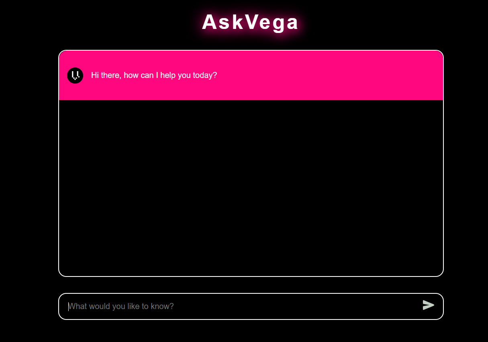
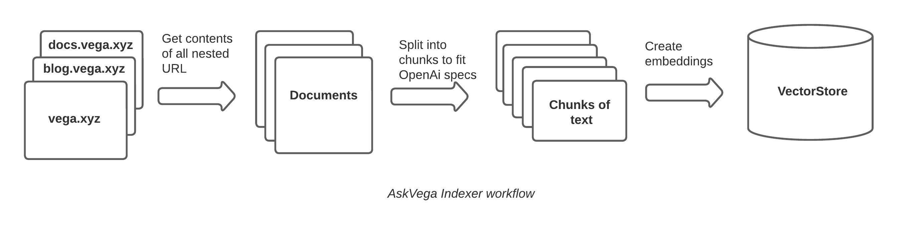
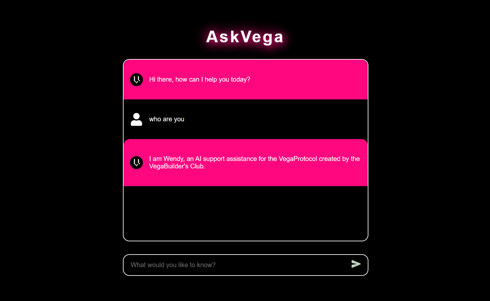

<!-- Logo -->
<br />
<div align="center">
  <a href="https://github.com/vega-builders-club">
    
  </a>

  <h3 align="center">AskVega</h3>

  <p align="center">
    An artificial intelligence support assistance for the VegaProtocol.
    <br />
    <a href="https://vega.xyz"><strong> Explore More About VegaProtocol »</strong></a>
    <br />
    <br />
  </p>
</div>

<!-- TABLE OF CONTENTS -->
<div>
  <summary>Table of Contents</summary>
  <ol>
    <li>
      <a href="#about-ask-vega">About Ask Vega</a>
      <ul>
        <li><a href="#built-with">Built With</a></li>
        <li><a href="#how-it-works">How It Works</a></li>
      </ul>
    </li>
    <li>
      <a href="#getting-started">Getting Started</a>
      <ul>
        <li><a href="#prerequisites">Prerequisites</a></li>
        <li><a href="#installation">Installation</a></li>
      </ul>
    </li>
    <li><a href="#usage">Usage</a></li>
    <li><a href="#roadmap">Roadmap</a></li>
    <li><a href="#contributing">Contributing</a></li>
    <li><a href="#license">License</a></li>
    <li><a href="#contact">Contact</a></li>
    <li><a href="#acknowledgments">Acknowledgments</a></li>
  </ol>
</div>

<!-- About Ask Vega -->

## About Ask Vega



AskVega is a custom knowledge base, large language model (LLM) trained using OpenAI tools based on the GPT-3.5 architecture. It is designed to process and generate human-like responses to questions relating to the VegaProtocol. It has been trained on a massive chunks of data and has the ability to understand and respond to a wide range of topics relating to protocol, making it useful for tasks such as support assistance.

<p align="right">( <a href="#readme-top">back to top</a> )</p>

<!-- Built With -->

### Built With

- [NextJS](https://nextjs.org/)
- [Python](https://www.python.org/)
- [OpenAi](https://openai.com/)
- [LangChain](https://python.langchain.com/en/latest/index.html)

<p align="right">( <a href="#readme-top">back to top</a> )</p>

<!-- How It Works -->

### How It Works

This entire projects can be summarised in few components;

1. Frontend

- Responsible for rendering friendly interface for interaction

2. Backend

- Responsible for;
  - Knowledge indexing
  - Question and answer engineering



The indexer takes an array of URL as input, it crawls each URL extracting the html source code and PDF files, then collects all the nested URL in that page, if the URL is a relative path, it builds an absolute path using the active root domain been crawled at that moment. It then extract all texts from the page and stores in memory as documents with the source URL as metadata.
At the end of the crawling process, this documents are then retrieved from memory and further split into chunks of not more than 1k characters as specified by the OpenAi embedding specs. An embedding is created from these chunks and stored in a vector database for fast retrieval.

When a user sends a message, the request is received as `text input` and passed through the question prompts to refine after which it's converted to slices of vectors and compared for similarities on our vector database, if a match is found, OpenAi will use that to build a conversational response.

<!-- Getting Started -->

## Getting Started

To get a local copy up and running

### Prerequisites

Ensure you have the latest version of the following installed;

- Nodejs
- NPM or Yarn
- Python
- Virtualenv

### Installation

To get started;

1. Get an API Key at [OpenAi](https://openai.com)
2. Clone this repository
   ```sh
   git clone https://github.com/vega-builders-club/askvega.git
   ```
3. Install UI dependencies
   ```sh
   # From the root folder terminal run
   cd interface
   yarn install
   yarn dev
   ```
4. Install server dependencies
   ```sh
   # On a new terminal run
   app/scripts/install
   ```
5. Update `askvega-config` with your OpenAi key
6. Run the indexer to build embeddings for our custom knowledge base
   ```sh
   app/scripts/index
   ```
7. Start the application

   ```sh
   app/scripts/run
   ```

   **NOTE\*\*\*** You might need to make the scripts executable, for example `chmod u+x scripts/install`

   <p align="right">( <a href="#readme-top">back to top</a> )</p>

<!-- Usage -->

## Usage



The project ships with a minimal user interface built with nextjs which interacts with the websocket endpoint of the backend.
On a local environment the UI will likely open on port 3000 and the backend server on port 80 by default.

<!-- Roadmap -->

## Roadmap

- [x] Prototype
- [ ] Deploy and test on live server
- [ ] Integrate the API with discord
- [ ] Fine tune the prompts more
- [ ] Cleanup the backend knowledge base indexer to be more, performant, modular and readable

If you do like to propose a new feature or an amendment, please use [open issues](https://github.com/vega-builders-club/askvega/issues).

<p align="right">( <a href="#readme-top">back to top</a> )</p>

<!-- Contributing -->

## Contributing

Feel like contributing? Awesome!!! We have a [contributing guide](https://github.com/vega-builders-club/askvega/CONTRIBUTING.md) to help guide you.

VegaProtocol lives in a separate repository. If you're interested in contributing to the core protocol, check out [VegaProtocol](https://github.com/vegaprotocol).

<p align="right">( <a href="#readme-top">back to top</a> )</p>
